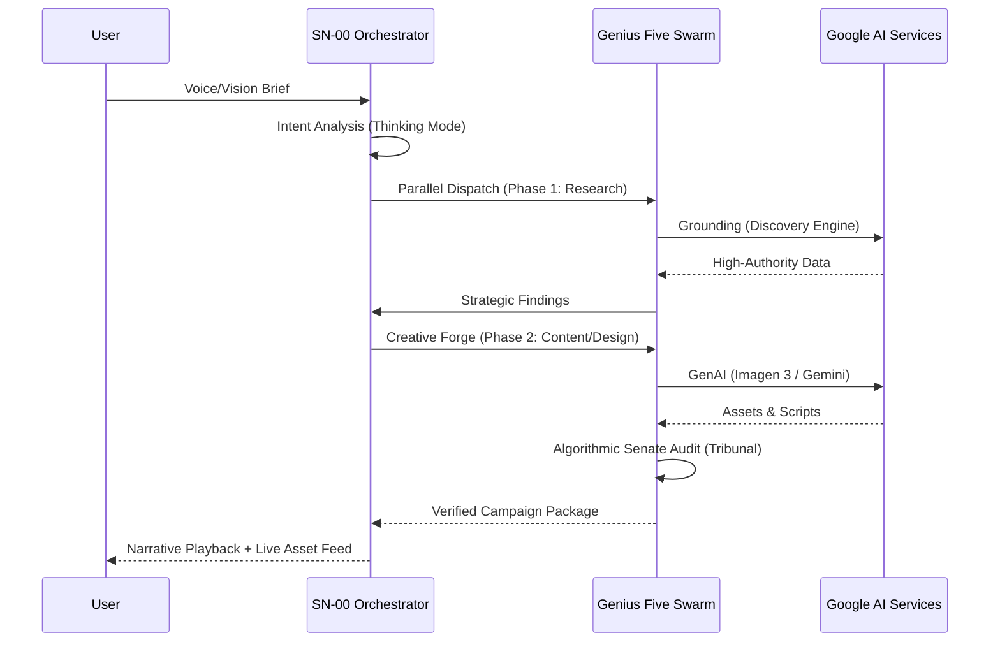

# ARCHITECTURE: AGENTICUM G5 GENIUS NEURAL FABRIC

## 1. SYSTEM OVERVIEW

The Neural Fabric is a real-time, multi-agent orchestration layer built on Google Cloud. It enables a voice-first, vision-enabled interaction model where five specialized agents collaborate to create marketing campaigns.

## 2. CORE COMPONENTS

### 2.1 User Layer (Console)

- **React 19 Console**: Real-time management interface.
- **WebSocket Gateway**: Bidirectional event streaming.
- **Microphone & Camera**: Multi-modal input streams.

### 2.2 Orchestration Layer (SN-00)

- **Neural Orchestrator**: Acts as the conversational maestro.
- **ADK-Native**: Built using the Google Agent Development Kit.
- **Thinking Mode**: Intent analysis and parallel dispatch.

### 2.3 The Genius Five Swarm

- **SP-01 (Strategist)**: Grounded in McKinsey/MIT knowledge via Discovery Engine.
- **RA-01 (Auditor)**: Hosts the **Algorithmic Senate** (Ethics/Economy/Ecology).
- **CC-06 (Director)**: Forges creative narratives and scripts.
- **DA-03 (Architect)**: Generates visual assets via Imagen 3.
- **PM-07 (Persistent)**: 24/7 proactive ecosystem agent.

### 2.4 Service Layer

- **Vertex AI Service**: Interface for Gemini 2.0 Flash and Imagen 3.
- **Discovery Engine Service**: Knowledge grounding across academic/professional databases.
- **Firestore Service**: Session persistence and sub-agent status tracking.
- **Storage Service**: High-fidelity asset hosting.

## 3. DATA FLOW (CHAMPIONSHIP GRADE)

## 4. DEPLOYMENT STACK

- **Cloud Run**: Scalable container runtime for backend and console.
- **GCP Pub/Sub**: Event triggers for PM-07.
- **Cloud Scheduler**: Cron-based triggers for proactive briefs.
