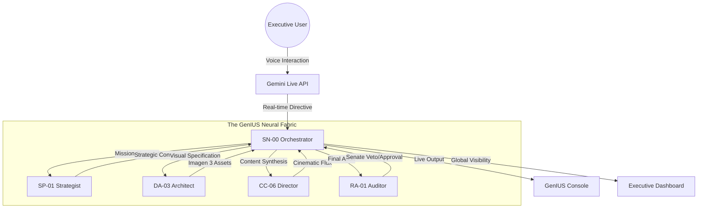
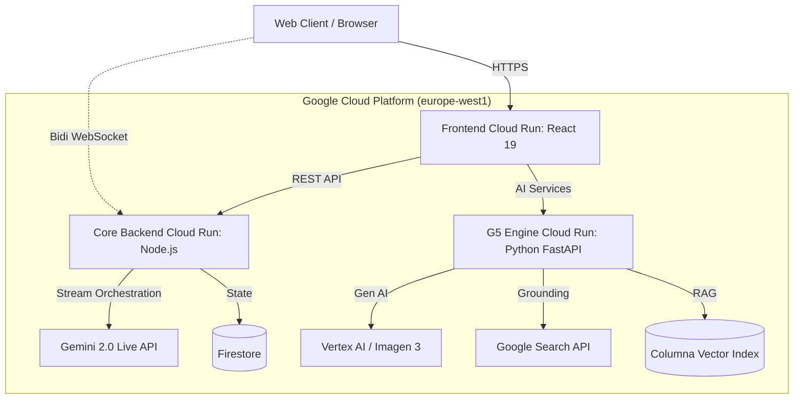

# 🛰️ GenIUS: The Neural Fabric OS

> **The Ultimate Multi-Agent Orchestration Layer for the Autonomous Enterprise.**

**Live Demo**: [https://agenticum-frontend-697051612685.europe-west1.run.app/demo](https://agenticum-frontend-697051612685.europe-west1.run.app/demo)

GenIUS is a hypermodern Enterprise Operating System designed to orchestrate complex swarms of autonomous agents. Powered by **Gemini 2.0 Flash** and the **Gemini Live API**, GenIUS bridges the gap between static automation and sentient workflow choreography, providing a zero-click marketing command center for the next industrial revolution.

---

## 🧠 Neural Architecture: The Swarm Fabric

GenIUS operates via a core matrix of specialized autonomous nodes, coordinated by the **SN-00 GenIUS Orchestrator**. The system utilizes a recursive **SwarmProtocol** to ensure mission alignment and real-time synchronization.



### The Specialist Matrix

1.  **SN-00 Orchestrator (OODA Node)**: High-speed parallel dispatch and mission consensus.
2.  **SP-01 Strategist (Blueprint Node)**: Grounded strategic planning using McKinsey-level mental models.
3.  **DA-03 Architect (Visual Node)**: Bauhaus-inspired asset generation via Imagen 3.
4.  **CC-06 Director (Grammar Node)**: Cinematic content orchestration and prompt engineering.
5.  **RA-01 Auditor (Senate Node)**: Adversarial security and ethical alignment tribunal.

---

## 🚀 Key Modules

- **GenIUS Console**: A real-time multimodal (Voice/Audio) interface powered by **Gemini Live API (WebSockets)**, allowing for seamless human-AI collaboration.
- **Synergy Map**: Live visual telemetry of inter-agent payload transmissions, providing absolute transparency into the swarm's recursive thinking.
- **Creative Studio**: Integrated design workspace for **Imagen 3** and **Gemini 2.0 Flash** collaborative asset forging.
- **Nexus Engine**: Direct blueprint-to-orchestration execution gateway for rapid deployment of complex marketing workflows.
- **Executive Dashboard**: Global swarm health, mission throughput, and real-time ROI optimization analytics.

---

## ⚡ Technical Stack

- **AI Core**:
  - **Gemini 2.0 Flash**: Core reasoning, recursive logic, and multimodal processing.
  - **Gemini Live API**: Low-latency WebSocket orchestration for voice-driven intent discovery.
  - **Imagen 3**: High-fidelity visual asset generation within the SwarmProtocol.
- **Frontend**: React 19, TypeScript, Framer Motion (Spatial Physics Engine), Tailwind CSS.
- **Backend**: Node.js, Express, WebSockets, Vertex AI SDK, Cloud Run.
- **Infrastructure**: Google Cloud Platform (Firestore, Cloud Storage, Vertex AI, Cloud Run).

---

## 🏗️ Cloud Run Architecture



---

## 🚀 Quick Start Guide

**Prerequisites:**

- Node.js 20+ and Python 3.11+
- Google Cloud Project with Gemini Live, Vertex AI, and Firestore enabled

### 1. Frontend Setup

```bash
cd landing
npm install
npm run dev
```

_Runs on `http://localhost:5173`_

### 2. Core API (Node.js)

```bash
cd backend
npm install
npm run dev
```

_Runs on `http://localhost:8080`_

### 3. G5 Engine (Python)

```bash
cd engine
pip install -r requirements.txt
uvicorn main:app --reload --port 8000
```

_Runs on `http://localhost:8000`_

_(Requires `.env` files with valid GCP credentials and Gemini API keys in each directory)_

---

## 🌍 Impact & Vision: The Zero-Click Future

GenIUS is not just a tool; it's a paradigm shift. By moving away from chat-based interfaces toward a **Sentient OS**, we enable enterprises to:

- **Speak into existence**: Direct voice-to-execution workflows.
- **Autonomous Alignment**: Multi-agent consensus ensures compliance and strategic depth.
- **Infinite Scalability**: A swarm that thinks and acts faster than any traditional marketing department.

---

**Built for the Google Gemini Live Agent Challenge 2026.**  
_GenIUS Status: 100% OPERATIONAL // MISSION READY_
