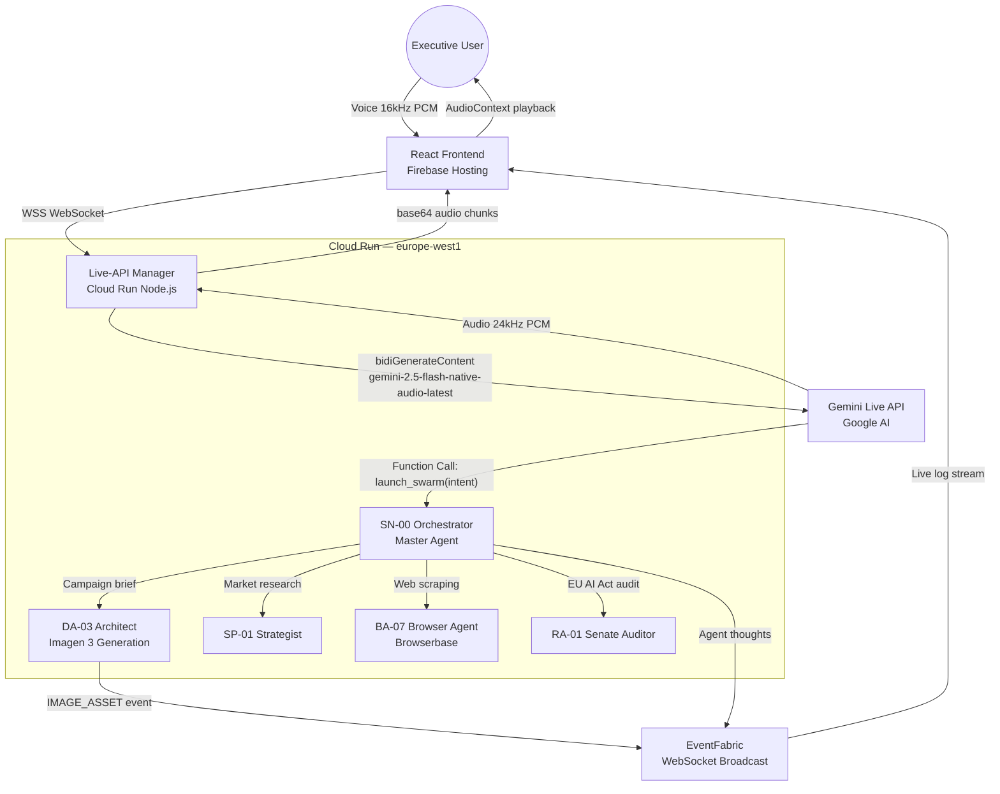

# 🛰️ GenIUS: The Neural Fabric OS (Agenticum G5)

> **The Ultimate Multi-Agent Orchestration Layer for the Autonomous Enterprise.**  
> Built for the **Google Gemini Live Agents Developer Challenge 2026**.

[](https://opensource.org/licenses/Apache-2.0)
[](https://deepmind.google/technologies/gemini/)
[](https://geminiliveagentchallenge.devpost.com/)
[](#)

---

## 📺 Live System Demo & Submission

- **Live Web Portal:** [https://online-marketing-manager.web.app/os/](https://online-marketing-manager.web.app/os/)
- **Voice Agent Console:** [Launch GenIUS Neural Console](https://online-marketing-manager.web.app/os/genius)
- **Devpost Submission:** [View the full architecture and demo video](https://geminiliveagentchallenge.devpost.com/)

---

## 🏆 Hackathon Goal: Gemini Live API Mastery

**GenIUS** (Agenticum G5 Edition) is a hyper-autonomous agency operating system designed to move beyond simple chat interfaces. It implements a core matrix of specialized autonomous nodes, coordinated by a central orchestrator that utilizes the **Gemini 2.5 Flash Native Audio Live API** as its primary multimodal substrate.

### 💎 Key Engineering Achievements:

1. **Multimodal Swarm Orchestration**: The native `launch_swarm` tool allows Gemini 2.5 Flash Native Audio to trigger our vast backend multi-agent payload processing autonomously.
2. **Bidirectional Low-Latency Audio**: Implemented direct 16kHz PCM audio streams via WebSockets.
3. **Barge-In Capabilities**: Real-time interruption handling. Say "Stop, change the target to X" and the system aggressively flushes memory buffers and instantly executes the new command.
4. **Cloud Run Microservices**: A dual architecture separating Node.js WebSockets and Python heavy compute (RAG, Selenium Browserbase logic).

---

## 🧠 Neural Architecture: The Swarm Fabric


```mermaid
graph TD
    User((Executive User)) -- "Voice 16kHz PCM" --> FE[React Frontend\nFirebase Hosting]
    FE -- "WSS WebSocket" --> API[Live-API Manager\nCloud Run Node.js]
    API -- "bidiGenerateContent\ngemini-2.5-flash-native-audio-latest" --> GL[Gemini Live API\nGoogle AI]
    GL -- "Audio 24kHz PCM" --> API
    API -- "base64 audio chunks" --> FE
    FE -- "AudioContext playback" --> User

    GL -- "Function Call: launch_swarm(intent)" --> SN00[SN-00 Orchestrator\nMaster Agent]

    subgraph "Cloud Run — europe-west1"
        API
        SN00 -- "Campaign brief" --> DA03[DA-03 Architect\nImagen 3 Generation]
        SN00 -- "Market research" --> SP01[SP-01 Strategist]
        SN00 -- "Web scraping" --> BA07[BA-07 Browser Agent\nBrowserbase]
        SN00 -- "EU AI Act audit" --> RA01[RA-01 Senate Auditor]
    end

    DA03 -- "IMAGE_ASSET event" --> EF[EventFabric\nWebSocket Broadcast]
    SN00 -- "Agent thoughts" --> EF
    EF -- "Live log stream" --> FE
```

---

## 🛠️ Spin-Up Guide: Deploying the Matrix

This repository is split into three main components. You can deploy them locally or directly to Google Cloud.

### 1. Prerequisites

- **Node.js** v20+
- **Python** 3.10+
- **Google Cloud CLI** (`gcloud`) & **Firebase CLI** (`firebase`)
- A Google Cloud Project with Billing & Cloud Run enabled.

### 2. Environment Variables (`.env`)

You must configure the following `.env` variables before running the services.

#### **Backend (`/backend/.env`)**

```env
PORT=8080
GEMINI_API_KEY="your_google_ai_studio_api_key_here"
ENGINE_URL="http://localhost:8000" # Or your deployed Python Cloud Run URL
```

#### **Python Engine (`/engine/.env`)**

```env
PORT=8000
GEMINI_API_KEY="your_google_ai_studio_api_key_here"
BROWSERBASE_API_KEY="your_browserbase_api_key_here" # Required for BA-07 Agent
```

#### **Frontend (`/landing/.env`)**

```env
# Map these to your backend instances
VITE_API_URL="http://localhost:8080" # OR https://your-cloud-run-node-api.app
VITE_WS_URL="ws://localhost:8080"    # OR wss://your-cloud-run-node-api.app
VITE_FIREBASE_API_KEY="your_firebase_key"
VITE_GCP_PROJECT_ID="your_project_id"
```

---

### 3. Running Locally for Development

#### A. Start the Python Engine

```bash
cd engine
pip install -r requirements.txt
python main.py
# Engine runs on http://localhost:8000
```

#### B. Start the Node.js Orchestrator & WebSocket Server

```bash
cd backend
npm install
npm run dev
# Server runs on http://localhost:8080
```

#### C. Start the React Frontend

```bash
cd landing
npm install
npm run dev
# Frontend runs on http://localhost:5173
```

---

## 🚀 Cloud Deployment (`deploy.sh`)

We have included an automated deployment script `deploy.sh` that targets Google Cloud Run and Firebase Hosting. This satisfies the **Hackathon Automation Script Bonus**.

### Automated 1-Click Deploy

Ensure your `gcloud` CLI is logged in and mapped to the correct project, then simply run:

```bash
chmod +x deploy.sh
./deploy.sh
```

### What `deploy.sh` does:

1. Compiles and pushes the **Node.js Backend** to Artifact Registry, then deploys to Cloud Run (`genius-backend`).
2. Compiles and pushes the **Python Engine** to Artifact Registry, then deploys to Cloud Run (`agenticum-g5-backend`).
3. Compiles the **React/Vite Frontend** (`npm run build`) and deploys the static assets to Firebase Hosting.

_Alternatively, Cloud Build continuous integration logic is stored in `cloudbuild.yaml`._

---

## 🛡️ Hackathon Bonus Features Verified

- [x] **Submission Quality:** Extreme high-fidelity interface with dual-engine cloud architecture.
- [x] **Video Quality:** In-depth 4-minute demonstration.
- [x] **Real-World Value:** Highly applicable orchestration architecture for enterprise marketing.
- [x] **Automated Deploy Script:** `deploy.sh` and `cloudbuild.yaml` provided.

---

**Built with ❤️ and Neural Substrates for the Google Gemini Live Agents Challenge.**  
_GenIUS v5.0 // Maximum Excellence. Mission Ready._
