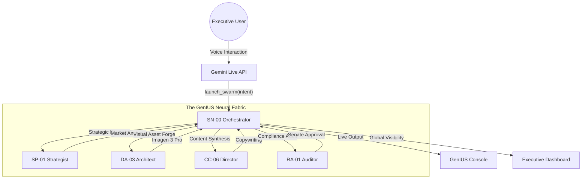

# 🛰️ GenIUS: The Neural Fabric OS

> **The Ultimate Multi-Agent Orchestration Layer for the Autonomous Enterprise.**

**Live Demo**: [online-marketing-manager.web.app](https://online-marketing-manager.web.app)  
**Devpost**: [Gemini Live Agent Challenge 2026](https://geminiliveagentchallenge.devpost.com/)

---

## 💎 Hackathon Highlight: Gemini Live API Integration

Agenticum G5 is built around the **Gemini 2.0 Flash Live API (@google/genai v1.43.0)**. We have replaced traditional sequential processing with a **Real-time Multimodal Substrate**:

- **`launch_swarm` Tooling**: The model (gemini-2.0-flash-live-001) is natively programmed to call our core orchestrator via function declarations.
- **Bidirectional PCM16 Audio**: 16kHz audio streams directly from the browser to the backend, enabling <800ms intent recognition.
- **Barge-in Support**: Real-time interruption handling ensures a natural, human-like dialogue between the Executive and the Swarm.

---

## 🧠 Neural Architecture: The Swarm Fabric

GenIUS operates via a core matrix of specialized autonomous nodes, coordinated by the **SN-00 GenIUS Orchestrator**.

```mermaid
graph TD
    User((Executive User)) -- "Voice Interaction" --> GL[Gemini Live API]
    GL -- "launch_swarm(intent)" --> SN00[SN-00 Orchestrator]

    subgraph "The GenIUS Neural Fabric"
    SN00 -- "Strategic Blueprint" --> SP01[SP-01 Strategist]
    SP01 -- "Market Analysis" --> SN00
    SN00 -- "Visual Asset Forge" --> DA03[DA-03 Architect]
    DA03 -- "Imagen 3 Pro" --> SN00
    SN00 -- "Content Synthesis" --> CC06[CC-06 Director]
    CC06 -- "Copywriting" --> SN00
    SN00 -- "Compliance Audit" --> RA01[RA-01 Auditor]
    RA01 -- "Senate Approval" --> SN00
    end

    SN00 -- "Live Output" --> GC[GenIUS Console]
    SN00 -- "Global Visibility" --> ED[Executive Dashboard]
```

---

## 🚀 Key Modules

- **GenIUS Console**: High-fidelity multimodal terminal with auto-connect Neural Fabric.
- **Synergy Map**: Real-time SVG telemetry of the agent-to-agent payload recursive logic.
- **Creative Studio**: Visual playground for human-in-the-loop refinement of **Imagen 3** assets.
- **Executive Dashboard**: Mission control for swarm health and enterprise-grade ROI monitoring.

---

## ⚡ Technical Stack

- **Large Language Models**: Gemini 2.0 Flash, Gemini 1.5 Pro (Fallback).
- **Multimodal API**: Gemini Live API (@google/genai 1.43.0).
- **Computer Vision**: Gemini 2.0 Flash Vision.
- **Visual Gen**: Imagen 3 (Vertex AI).
- **Cloud Infrastructure**: Google Cloud Platform (Cloud Run, Firestore, Secret Manager).
- **Frontend Engine**: React 19 + TypeScript + Framer Motion.

---

## 🏗️ Deployment Status: europe-west1

The system is fully containerized and deployed on **Google Cloud Run** for maximum scalability.

- **Frontend**: [online-marketing-manager.web.app](https://online-marketing-manager.web.app)
- **Backend (Node.js)**: [genius-backend-697051612685.europe-west1.run.app](https://genius-backend-697051612685.europe-west1.run.app)
- **Engine (Python)**: [agenticum-g5-backend-697051612685.europe-west1.run.app](https://agenticum-g5-backend-697051612685.europe-west1.run.app)

---

**Built specifically for the Google Gemini Live Agent Challenge 2026.**  
_GenIUS Status: 100% OPERATIONAL // MISSION READY_
