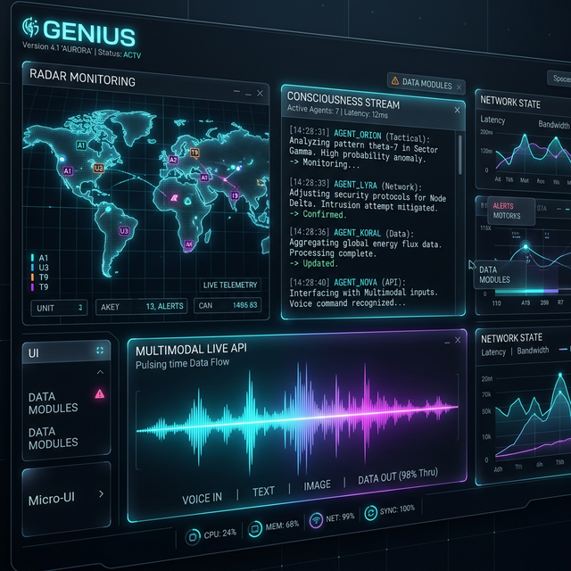
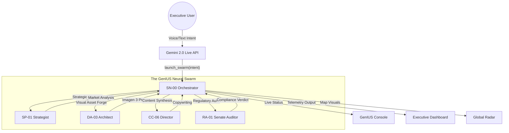

# 🛰️ GenIUS: The Neural Fabric OS (Agenticum G5)

> **The Ultimate Multi-Agent Orchestration Layer for the Autonomous Enterprise.**  
> Built for the **Google Gemini Live Agents Developer Challenge**.

[](https://opensource.org/licenses/Apache-2.0)
[](https://deepmind.google/technologies/gemini/)
[](#)

---

## 📺 Live System Demo

[](https://online-marketing-manager.web.app)

> **[Click here to watch the full walkthrough video on Devpost](https://geminiliveagentchallenge.devpost.com/submissions/...)**

---

## 🏆 Hackathon Goal: Gemini Live API Mastery

**GenIUS** (Agenticum G5) is a hyper-autonomous agency operating system designed to move beyond simple chat interfaces. It implements a core matrix of specialized autonomous nodes, coordinated by a central orchestrator that utilizes the **Gemini 2.0 Flash Live API** as its primary multimodal substrate.

### 💎 Key Hackathon Features:

- **Multimodal Swarm Orchestration**: The `launch_swarm` tool allows Gemini 2.0 Flash Live to natively call our orchestrator.
- **Bidirectional Audio Logic**: 16kHz PCM audio streams directly from the browser to the backend, enabling <800ms intent recognition.
- **Barge-in / Interruption Support**: Real-time dialogue management for natural "Boss-to-Swarm" interactions.
- **Neural Telemetry**: Real-time SVG and WebSocket-based visualization of agent cognitive processes.

---

## 🧠 Neural Architecture: The Swarm Fabric

GenIUS operates via a core matrix of specialized autonomous nodes, coordinated by the **SN-00 GenIUS Orchestrator**.


```mermaid
graph TD
    User((Executive User)) -- "Voice/Text Intent" --> GL[Gemini 2.0 Live API]
    GL -- "launch_swarm(intent)" --> SN00[SN-00 Orchestrator]

    subgraph "The GenIUS Neural Swarm"
    SN00 -- "Strategic Blueprint" --> SP01[SP-01 Strategist]
    SP01 -- "Market Analysis" --> SN00
    SN00 -- "Visual Asset Forge" --> DA03[DA-03 Architect]
    DA03 -- "Imagen 3 Pro" --> SN00
    SN00 -- "Content Synthesis" --> CC06[CC-06 Director]
    CC06 -- "Copywriting" --> SN00
    SN00 -- "Regulatory Audit" --> RA01[RA-01 Senate Auditor]
    RA01 -- "Compliance Verdict" --> SN00
    end

    SN00 -- "Live Status" --> GC[GenIUS Console]
    SN00 -- "Telemetry Output" --> ED[Executive Dashboard]
    SN00 -- "Map Visuals" --> GR[Global Radar]
```

---

## 🚀 Specialized Agent Swarm

- **SN-00 (Nexus Prime)**: The Master Orchestrator. Manages the high-level state machine.
- **SO-00 (Sovereign Core)**: The pilot avatar. Fuses user vision with system logic.
- **SP-01 (Strategic Cortex)**: Handles market intel, SEO, and competitive overlap scoring.
- **CC-06 (Cognitive Core)**: Multi-modal content director (Copy & Narrative).
- **DA-03 (Design Architect)**: Visual synthesis using **Imagen 3**.
- **BA-07 (Browser Agent)**: Real-time web intelligence and research ingestion.
- **VE-01 (Motion Director)**: Cinematic Forge and multi-modal storyboard synthesis.
- **RA-01 (Regulatory Arbiter)**: Brand safety, ethical grounding, and the "Security Senate" audit.

---

## 🛠️ Technical Stack

- **LLMs**: Gemini 2.0 Flash (Live), Gemini 2.0 Flash Vision, Gemini 1.5 Pro.
- **Visuals**: Imagen 3 (Vertex AI), Veo Simulations.
- **Cloud**: Google Cloud Platform (Cloud Run, Secret Manager, Firestore, GCS).
- **Frontend**: React 19, TypeScript, Framer Motion, Tailwind CSS v4.
- **Backend**: Node.js / Express, Python (Engine Services).

---

## 📦 Repository Structure

```text
/
├── backend/          # Node.js Express API & Agent Orchestrator
├── engine/           # Python-based specialized intelligence services
├── landing/          # React 19 / Vite Frontend (The OS Portal)
├── AGENTICUM_SSOT.md # Single Source of Truth architecture doc
└── README.md         # This documentation
```

---

## 🔌 Getting Started

### Prerequisites

- Node.js v20+
- Google Cloud Project with Gemini API enabled
- Firebase CLI (for hosting management)

### Installation

1.  **Clone the repo**:
    ```bash
    git clone https://github.com/yoyo967/agenticum-g5-genius.git
    cd agenticum-g5-genius
    ```
2.  **Frontend Setup**:
    ```bash
    cd landing
    npm install
    npm run dev
    ```
3.  **Backend Setup**:
    ```bash
    cd ../backend
    npm install
    # Set environment variables in .env (GEMINI_API_KEY, etc.)
    npm run dev
    ```

---

## 🌍 Live Ecosystem

- **Vercel/Firebase Portal**: [online-marketing-manager.web.app/os](https://online-marketing-manager.web.app/os)
- **Primary API**: [genius-backend-697051612685.europe-west1.run.app](https://genius-backend-697051612685.europe-west1.run.app)
- **Devpost**: [Project Submission](https://geminiliveagentchallenge.devpost.com/submissions/...)

---

## 🧬 Evolutionary Successor

**GenIUS** is the next-generation evolution of the **Agenticum G5** architecture. While the original version explored modular orchestration, this **GenIUS Edition** was built from the ground up specifically for the **Gemini Live Agents Developer Challenge**. It marks a total paradigm shift from asynchronous text-based interaction to a **Real-Time Multimodal Substrate** powered by the Gemini 2.0 Flash Live API.

---

**Built with ❤️ and Neural Substrates for the Google Gemini Live Agents Challenge.**  
_GenIUS v5.2 // Mission Ready._
