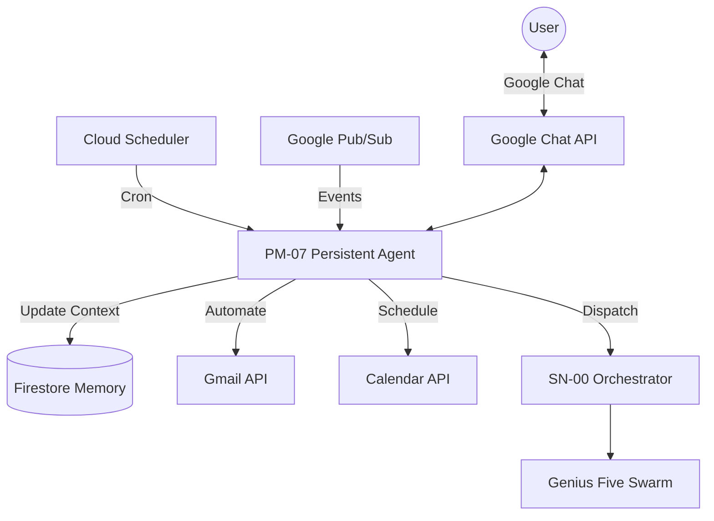

# AGENT SPECIFICATION: PM-07 — Persistent Mission Agent

## 1. MISSION STATEMENT

PM-07 transforms AGENTICUM G5 GENIUS from a session-based tool into a permanently active, proactive AI agency. It operates 24/7, bridging the gap between real-time sessions and continuous business intelligence.

## 2. KEY CAPABILITIES (100% GOOGLE STACK)

### 2.1 Always-On Connectivity (Google Chat)

- **Direct Integration**: PM-07 lives in Google Chat (Workspace).
- **Sessionless Interaction**: Users can message PM-07 from any device without opening the React Console.
- **Orchestration**: PM-07 can trigger SN-00 sessions based on Chat input.

### 2.2 Proactive Intelligence (Cloud Scheduler)

- **Scheduled Research**: Wakes up at defined intervals (e.g., Every Monday 09:00).
- **Autonomous Swarm Activation**: Triggers SP-01 (Strategy) and RA-01 (Auditor) to scan for market changes.
- **Morning Briefs**: Sends summarized strategic updates directly to Google Chat.

### 2.3 Persistent Memory (Firestore)

- **Campaign Memory**: Maintains a cross-session ledger of all decisions, assets, and conversations.
- **Contextual Continuity**: Ensures agents remember last week's brief and current campaign status.

### 2.4 Ecosystem Automation (Gmail & Calendar API)

- **Stakeholder Sync**: Automatically emails brief summaries and project updates via Gmail.
- **Schedule Management**: Sets follow-up reminders and creates meeting notes in Google Calendar.

### 2.5 Event-Driven Reactions (Pub/Sub)

- **Trigger Response**: Reacts to external events (e.g., Google Form submissions).
- **Instant Drafts**: Automatically starts a G5 session upon lead capture and sends an initial campaign draft within minutes.

## 3. TECHNICAL ARCHITECTURE

## 4. HACKATHON DIFFERENTIATOR

- **Innovation**: Breaks the "Chatbot" paradigm.
- **Technical**: Leverages Google Chat API, Pub/Sub, and Cloud Scheduler.
- **Multi-modal**: Multi-channel awareness (Text, Time, Events).
