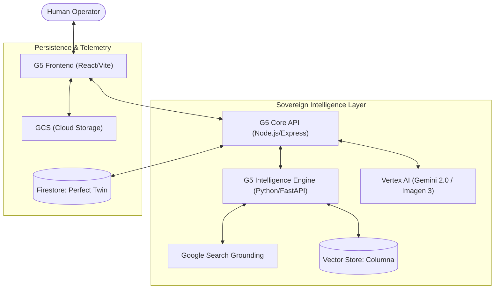

# 🏗️ ARCHITECTURE BLUEPRINT: AGENTICUM G5

## 1. System Topology: Tri-Node Cloud Mesh

AGENTICUM G5 is built on a serverless, decoupled architecture consisting of three core pillars, all hosted on **Google Cloud Platform (GCP)**.

## 2. Pillars

### 2.1 G5 Frontend (React 19 / Vite)

- **Role:** High-fidelity OS Portal and GenIUS Console.
- **Tech Pack:** Framer Motion (Animations), Tailwind CSS v4, Lucide Icons.
- **Protocol:** WebSocket (Bi-directional voice & data), REST (Syncing).

### 2.2 G5 Core API (Node.js)

- **Role:** Orchestration and Swarm Management.
- **Orchestrator:** **SN-00** (Systems Thinking Node).
- **Compliance:** **RA-01** (Algorithmic Senate).
- **Communication:** `Socket.io` for real-time agent state broadcasts.

### 2.3 G5 Intelligence Engine (Python)

- **Role:** Heavy-lifting AI tasks and Market Intelligence.
- **Engine:** **SP-01** (Strategist) & **Columna Radar**.
- **Tools:** `Playwright` (Browsing), `FastAPI` (Async endpoints).

## 3. Communication Protocols

- **Bidi-Streaming:** Gemini Live API (WebSocket) for sub-100ms voice response.
- **EventFabric:** Custom internal bus for cross-agent payload transfers.
- **Perfect Twin Sync:** Every tool call and inference is mirrored to Firestore in real-time.

## 4. Deployment Strategy

- **CI/CD:** Google Cloud Build & Artifact Registry.
- **Compute:** Cloud Run (Serverless, Auto-scaling).
- **Persistence:** Cloud Firestore (Native Mode), Cloud Storage.

---

_Revision: G5-ARCH-00032_
