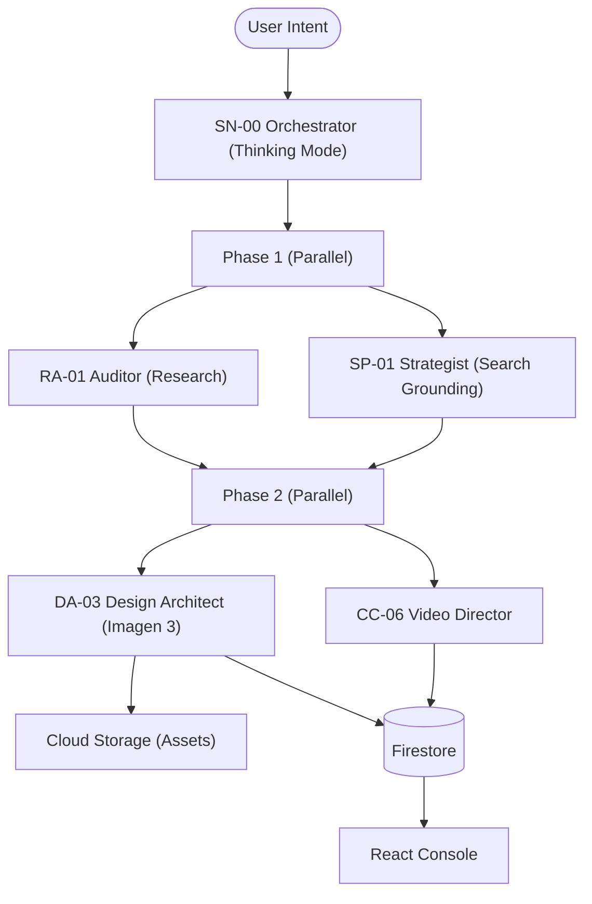

# 🌌 AGENTICUM G5

### **Autonomous Marketing Operating System**

Built 100% on **Google Cloud Platform**. Powered by **Gemini 2.0 Flash** & **Imagen 3**.

---

## 🚀 The Vision

AGENTICUM G5 is a next-generation marketing engine that transforms simple ideas into professional, high-impact campaigns in seconds. By orchestrating multiple specialized AI agents, G5 handles everything from deep market research to visual identity generation.

## 🤖 How it works

Type one command. Watch specialized agents collaborate autonomously in real-time:

- **SN-00 (Orchestrator)**: Analyzes intent using **Thinking Mode** and plans the execution.
- **SP-01 (Strategist)**: Crafts marketing strategy using **Google Search Grounding**.
- **RA-01 (Auditor)**: Performs competitive intelligence using **real-time data**.
- **CC-06 (Video Director)**: Concepts video ads & generates Veo prompts.
- **DA-03 (Design Architect)**: Creates visual identities and generates **Imagen 3** hero images.

## 🏗️ Technical Architecture

AGENTICUM G5 leverages a cloud-native architecture for maximum performance and scalability:



## 🛠️ Tech Stack

- **AI Engine**: Vertex AI (Gemini 2.0 Flash, Imagen 3, Google Search Grounding)
- **Frontend**: React 19, Vite, TypeScript, Framer Motion
- **Backend**: Cloud Functions (Node.js 20, Gen 2)
- **Infrastructure**: Firestore (NoSQL), Cloud Storage (Large Assets), Google Cloud Run

## ⚡ Quick Start (Pure GCP CLI)

No complex setup needed. All deployments are handled via standard GCP CLI tools.

```bash
# Setup Environment
export PROJECT_ID="tutorai-e39uu"

# Deploy in 5 steps:
bash deploy/01-setup-infra.sh      # 1. Infrastructure (GCS, Firestore, etc.)
bash deploy/02-deploy-functions.sh # 2. Backend Orchestrator
bash deploy/04-deploy-console.sh   # 3. React Management Console
bash deploy/03-deploy-landing.sh   # 4. Premium Landing Page
bash deploy/05-verify.sh           # 5. Success Verification ✅
```

---

_Built with ❤️ for the Google Gemini API Hackathon._
_100% Serverless. 100% Autonomous._
