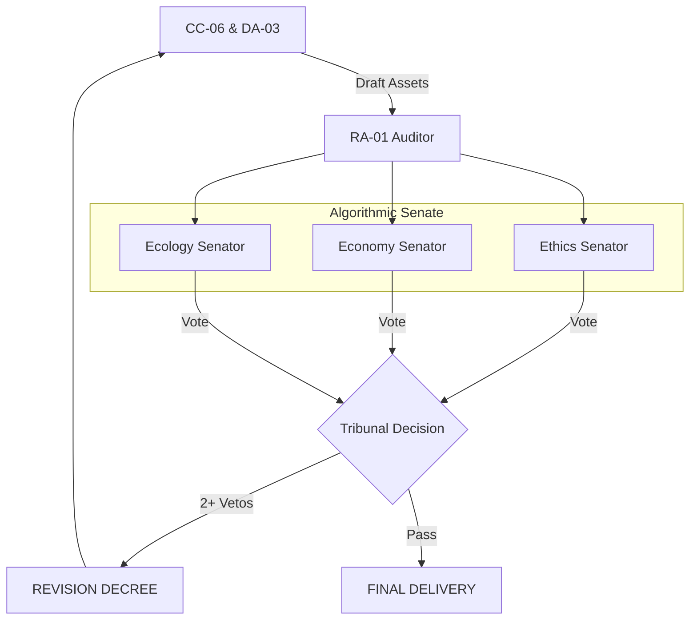

# ARCHITECTURE SPECIFICATION: The Algorithmic Senate

## 1. CONCEPT

The Algorithmic Senate is a specialized internal tribunal within the Auditor node (MI-01/RA-01) that ensures "Responsible AI" through adversarial debate. It is not a single agent, but a triad of three specialized sub-voices.

## 2. THE SENATORS

### ⚖️ ETHIK (Ethics Senator)

- **Focus**: Manipulation, Dark Patterns, exploitative tactics, misleading statistics, and "Bait-and-Switch" patterns.
- **Directive**: Protect the user's integrity and brand reputation.

### 💰 ÖKONOMIE (Economy Senator)

- **Focus**: Truthfulness of ROI claims, price transparency, realistic promises, and clarity of business terms.
- **Directive**: Ensure commercial viability and honesty.

### 🌱 ÖKOLOGIE (Ecology Senator)

- **Focus**: Greenwashing detection, verification of sustainability claims, and consistency between brand promises and reality.
- **Directive**: Guard against environmental misinformation.

## 3. THE WORKFLOW

1. **Submission**: CC-06 (Content) and DA-03 (Design) deliver the final campaign package.
2. **Debate**: Each Senator analyzes the package from their specific perspective simultaneously.
3. **Voting**:
   - **All Approve**: Campaign is cleared for delivery.
   - **One Veto**: Warning flag added, but execution continues.
   - **Two+ Vetos**: **Automatic Stoppage**. The campaign is sent back to the creative agents with a "Revision Decree".

## 4. ARCHITECTURE INTEGRATION

## 5. HACKATHON COMPLIANCE & STRATEGY

- **Responsible AI**: Directly addresses Google's focus on AI safety and ethics.
- **Innovation**: Showcases sophisticated multi-agent reasoning beyond simple generation.
- **UX**: Narrated debate in the console creates a powerful "Aha" moment for the jury.
